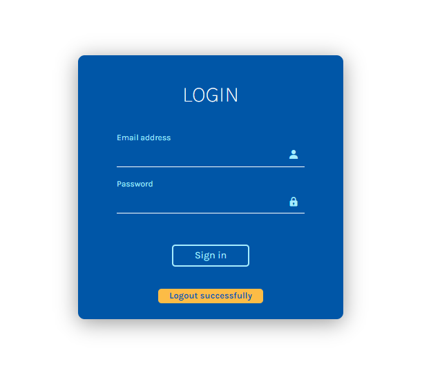
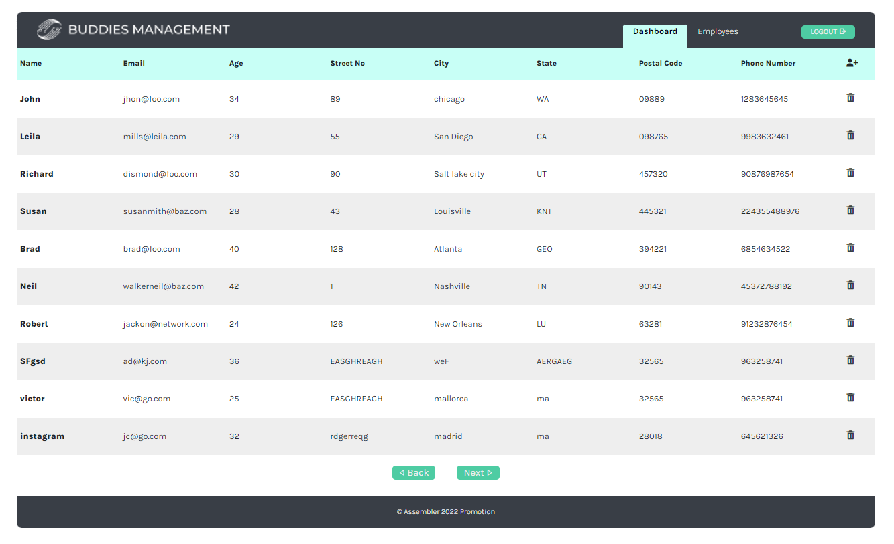
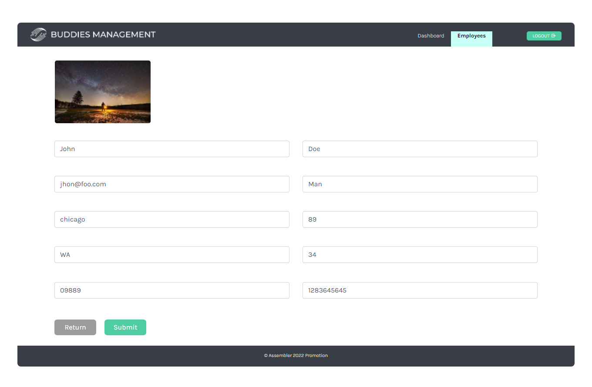

# PHP BASIC APPLICATION TO MANAGE AN EMPLOYEES LIST

## Application main points

1. Login and logout with a json file as user storage
2. Controlled user session set to 10 minutes
3. Show data from a JSON in a JS Grid
4. Pagination of the data configured by the grid
5. Employees CRUD Create Read Delete and Update with a json file as employees storage
6. Employee page with employee detail
7. External web service to get employees images
8. Employee avatar through web service images

### File structure

This file structure has a specific purpose. So you have to implement all the required over it. Later when we get to OPP and MySQL we will refactor the project to get it more sophisticated, modern and cleaner. Please take care of it!!

```
assets/
resources/
src/
 /library
```

- Assets contains html, css, js & images
- Css just css files.
- Resources folder contains users.json and employees.json
- Src folder contains PHP files which contain HTML or JS
- Src/library folder contains PHP files that contain just PHP

## Organization

The first step is make a diagram of the actions
The second step is divide the main functionalities in smaller functions 
The way we take to develop was:
1. Login
2. Show the users data on dashboard
3. Adding users
4. Update users data
5. Delete users
6. Show all data users on employees.php
7. Import Api images
8. Log out

## Technologies Used

HTML, JS, CSS, PHP, APACHE, BEM, SMACSS, CRUD, MVC

## Images





## Images Web Service for the extra feature

We use pixabay API to fecth the images.

## Contributors

<a href="https://github.com/Jesusjha">Jesús Herrera</a>
<a href="https://github.com/victor-gv">Victor Garcia-Vao</a>
<a href="https://github.com/JcarlosCabello1991">Juan Carlos Cabello</a>
